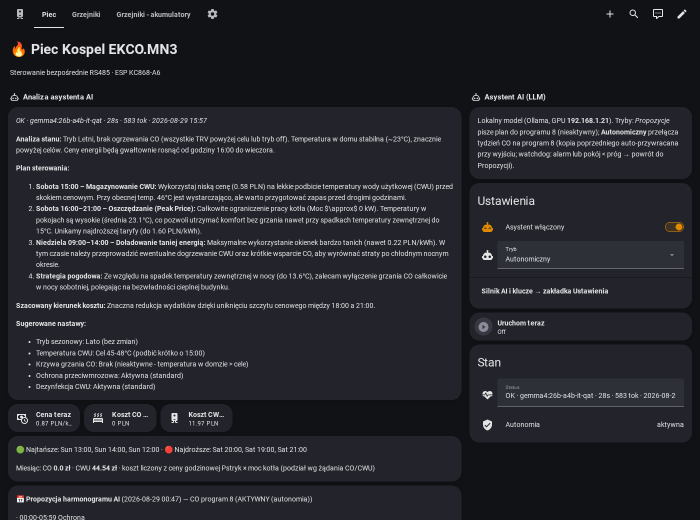
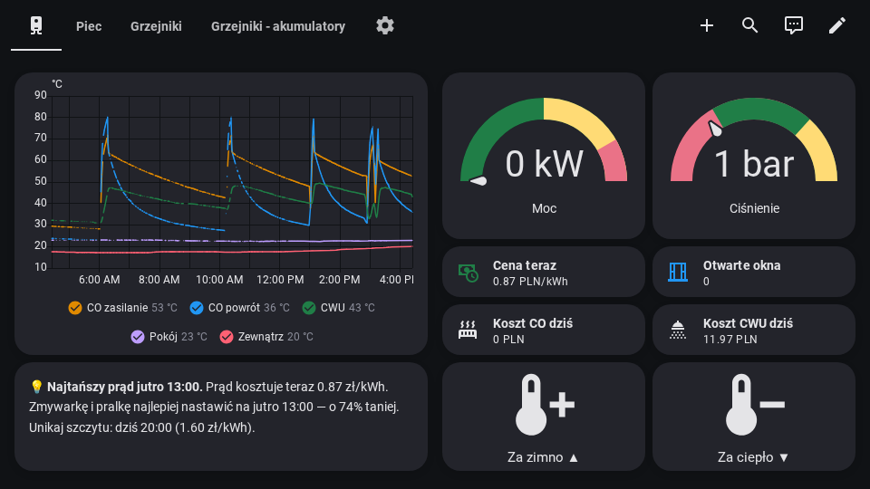
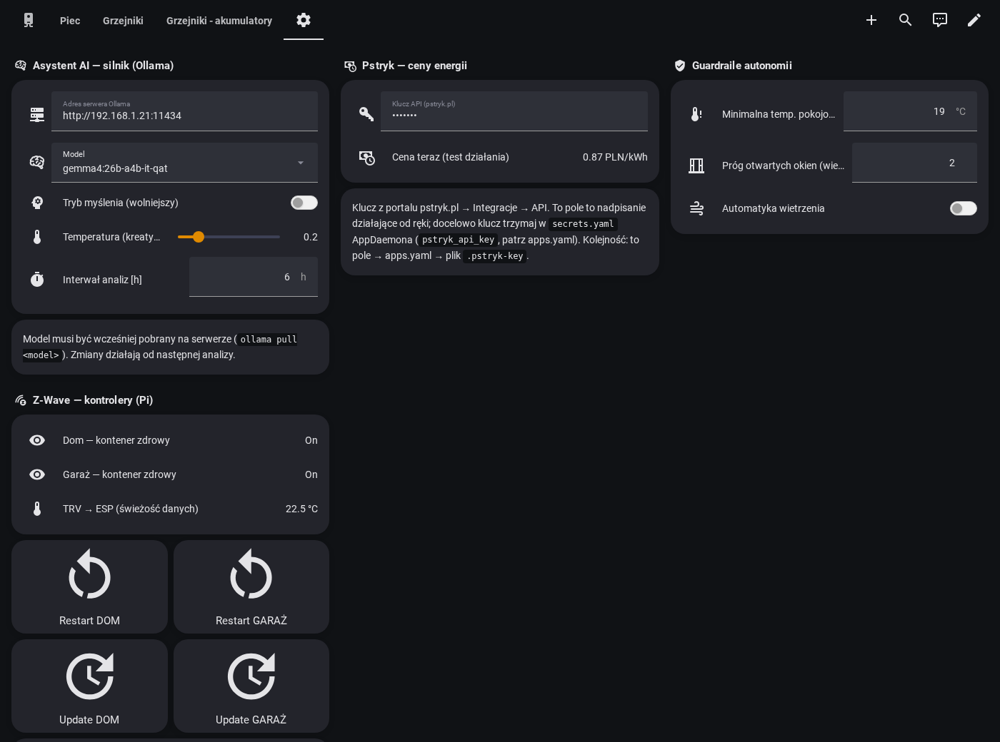

# esphome-kospel

🇵🇱 [Wersja polska](README.pl.md)

**Full local control of a Kospel EKCO.MN3 electric boiler (+ C.MG3 mixing module) over RS485 —
with an optional local-LLM "AI caretaker" that steers heating around dynamic electricity prices.**

Born when the original Kospel **C.MI** internet module started dying. Instead of replacing it,
this project puts an ESP32 (Kincony **KC868-A6**) on the RS485 bus as the Modbus master and
re-implements the C.MI's entire feature set in [ESPHome](https://esphome.io) — then goes further:
price-aware schedules, per-room window failsafe, cost accounting good enough to bill tenants,
and a supervised autonomous mode with hard guardrails.

> ⚠️ **Disclaimer**: this controls real heating hardware over an undocumented (reverse-engineered)
> protocol. Registers were mapped from the C.MI's local web app and live bus sniffing on
> EKCO.MN3 + C.MG3. Use at your own risk. Never run the ESP master and the C.MI on the bus
> at the same time (the firmware includes relay-based bus handover if you wire the C.MI through
> relays 5/6).

## What you get

- **1:1 C.MI feature port** — temperatures, power, pressure/flow, operating modes, weekly
  programs + daily-program editor (all 4 timetables: CO / CWU / circulation / C.MG3), heating
  curves, disinfection (anti-legionella), pump config, special modes (party/vacation/turbo),
  RTC sync from NTP, error decoding — ~150 entities in Home Assistant.
- **Write pending/confirm framework** — a changed setting *holds* in the UI until the heater
  confirms it (no snap-back); failures surface as a red banner + notification.
- **AI caretaker (optional)** — an AppDaemon app driving a local LLM (Ollama): analyses state,
  weather forecast, 6 h trends and hourly prices ([pstryk.pl](https://pstryk.pl)); writes proposed
  daily programs into the heater's unused **program 8** (shadow mode) or actively points the week
  at them (**Autonomiczny**) with watchdog + automatic rollback. Learns the household's hot-water
  rhythm from tank-temperature draw detection — no water meter needed.
- **Price-driven power plan (opt-in)** — the heater has no native power schedule, so the AI
  pushes a rolling 24 h plan into the ESP (expensive hours 12 kW, normal 20, cheap 24) and the
  ESP executes it with local guards even with HA down: comfort floor, tank below 35 °C (heavy
  hot-water usage mid-peak → full power to recover, then re-cap) and anti-legionella always win;
  a stale plan (>26 h) safely reverts to full power; your own setting returns when autonomy exits.
- **Billing-grade energy/cost stack** — CO/CWU split power → kWh meters → PLN totals at exact
  hourly prices (Energy-Dashboard-ready, statistics kept forever).
- **Wall-panel dashboard** (1080p landscape tablet) + appliance advice card
  ("Prąd drogi — nastaw zmywarkę na 13:00, o 60% taniej").
- **Optional: Fibaro TRV integration** — per-room temperatures and open-window detection via a
  Z-Wave JS Pi; the ESP receives a UDP feed directly from the Pi, so the
  *windows-open → pause heating* failsafe works even with Home Assistant down.

## Screenshots

The AI caretaker's analysis and controls on the main dashboard:



Wall-panel view (1080p landscape tablet, no scrolling) with the appliance price advisor:



Settings view — Ollama engine, Pstryk API key, autonomy guardrails, Z-Wave controller health:



## Hardware

| Part | Notes |
|---|---|
| Kospel EKCO.MN3 | slave `0x65`; C.MG3 mixing module slave `0x69` |
| Kincony KC868-A6 (ESP32) | built-in RS485; 9600 8N1, Modbus RTU, func 0x03/0x10, little-endian on wire |
| RS485 A/B | to the heater's C.MI connector; optionally route the C.MI through relays 5/6 for bus handover |
| *(optional)* Raspberry Pi + Z-Wave stick | zwavejs2mqtt/Z-Wave JS UI for Fibaro FGT-001 TRVs |
| *(optional)* any box with a GPU | Ollama for the AI caretaker (a ~30B-class model works well) |

## Install

**→ New here? Follow the detailed step-by-step guide: [docs/INSTALL.md](docs/INSTALL.md)**
(wiring, first USB flash, HA packages, dashboards import, Ollama + AppDaemon setup,
optional Z-Wave, verification checklist, troubleshooting).

The short version:

### 1. Firmware (required)

```bash
cd esphome
cp secrets.yaml.example secrets.yaml     # fill in; never commit
# Review the EDIT ME markers in gen_master.py (static IP, UDP feed address)
python3 gen_master.py                    # generates kc868-a6-heater-master.yaml
esphome run kc868-a6-heater-master.yaml
```

Add the device to Home Assistant (ESPHome integration, encrypted API). **Physically disconnect
the C.MI** (or wire it through relays 5/6 and use the "Bus owner" switch).

### 2. Home Assistant packages (required for costs/AI)

Enable packages in `configuration.yaml`, then copy from `homeassistant/packages/`:

- `kospel_helpers.yaml` — input helpers the AI expects (modes, thresholds, Ollama address)
- `kospel_energia.yaml` — CO/CWU power split, kWh meters, PLN cost integrals + daily/monthly
  meters. Point the Energy Dashboard at `sensor.kospel_energia_co/cwu` with your hourly price
  entity. Totals live in long-term statistics → season billing = end minus start.

`homeassistant/dashboards/wall_panel.json` is a ready wall-panel view (paste into a dashboard
via raw editor; fits 1080p landscape tablets without scrolling). It references two aggregate
sensors from the optional TRV setup (`sensor.dom_otwarte_okna`, `sensor.dom_temperatura_min`) —
remove those two tiles or point them at your own sensors if you skip Z-Wave.

### 3. Enable the AI caretaker (optional)

1. Run [Ollama](https://ollama.com) somewhere on your LAN and pull a model
   (e.g. `ollama pull gemma4:26b-a4b-it-qat`).
2. Install the **AppDaemon** add-on. Copy `appdaemon/kospel_llm.py` and `apps.yaml.example`
   (as `apps.yaml`) into `/addon_configs/a0d7b954_appdaemon/apps/`.
3. Configure the app the AppDaemon-canonical way — `apps.yaml` args with `!secret`
   (see `apps.yaml.example` + `secrets.yaml.example`): `ollama_host` and `pstryk_api_key`.
   The **Ustawienia** dashboard view offers runtime overrides on top (a password-type
   `input_text.kospel_pstryk_api_key` helper and the Ollama host field) — handy, but note an
   input_text state is readable by any logged-in HA user; secrets.yaml is the more private home
   for the key. Resolution order: UI helper > apps.yaml > legacy `.pstryk-key` file.
4. Set `input_text.kospel_llm_host` to your Ollama URL, pick the model, and switch
   `input_select.kospel_llm_tryb` through the maturity ladder:
   - **Doradca** — analysis text only, writes nothing;
   - **Propozycje (shadow)** — additionally writes proposed daily programs into **program 8**
     (inactive unless you point a weekday at it) — run this for a few days and read its plans;
   - **Autonomiczny** — backs up your weekly assignments, points CO/CWU/circulation at
     program 8, and keeps refreshing it. Exit the mode (or any watchdog trip) restores your
     backup automatically.

   Guardrails in autonomous mode: boiler alarm (debounced), room-temperature floor
   (`input_number.kospel_ai_min_pokoj`), ESP-offline grace, daily write budget, and the AI can
   only ever *downgrade* itself — it never enables autonomy.

### 4. Fibaro TRVs via Z-Wave (optional)

Skip this entirely if you don't have Z-Wave radiator heads — everything above works without it.

1. On the Pi running Z-Wave JS: install `zwave-agent/zwave_agent.py` (see
   `zwave-agent.service.example`; edit the `TRV` node-id→room map).
   The agent serves `/trv.json` + `/health`, self-heals the zwave-js container
   (restart/rollback-safe update), and **pushes** `{okna, min_temp}` to the ESP by UDP every
   30 s — deliberately push-over-UDP: an HTTP pull from the ESP proved to disrupt its HA API
   connection (see Lessons).
2. Copy `homeassistant/packages/kospel_zwave.yaml` (edit the Pi IPs) for health sensors +
   restart/update REST commands, and optionally run `zwave-agent/selfheal_automations.py`
   to create the down→restart / stale→update / weekly-update automations.

## Modbus map (highlights)

All values little-endian **on the wire** (byte-swapped vs Modbus convention). Slaves: heater
`0x65`, C.MG3 `0x69` (rejects coalesced wide reads — use single-register commands).

| Area | Registers |
|---|---|
| Temperatures (CO in/out, CWU, room, outside…) | `0x0B3B…0x0B50` region |
| Status / mode / error words | `0x0B51`, `0x0B55` (bit3 = Lato, bit5 = Zima), `0x0B52` |
| Setpoints (DHW eco/comfort, room, CO max/manual, curves) | `0x0B62…0x0B8D` |
| Daily programs (5 slots × start/stop/level) | CO base `0x0C1C`, CWU `0x0C9E`, circulation `0x0D20`, C.MG3 `0x0B90`; program *N* = base + 15·(N−1) |
| Weekly assignments (Mon..Sun) | CO `0x0C94-0x0C9A`, CWU `0x0D16-0x0D1C`, circ `0x0D98-0x0D9E`, C.MG3 `0x0C08-0x0C0E` |
| RTC | `0x0AF6` (7 regs), written hourly from SNTP |
| Keep-alive | write `{0x0000, 0x0100}` to `0x0BAE` every 10 s (C.MI heartbeat) |

Some config registers only latch when the config word (`0x0B55`/`0x0B54`) is re-written in the
same burst — the generator handles these "gated" writes.

## Config flags & season

The heater's season and subsystem-enable flags live in one word (`0x0B55`). There's a
non-obvious ordering rule (enable the DHW tank *before* selecting summer) and a safe recovery
procedure — see **[docs/CONFIG-FLAGS.md](docs/CONFIG-FLAGS.md)**.

## Lessons learned (the expensive ones)

- **ESPHome `http_request` polling can reset your API connection.** Periodic 0.5 s
  `unavailable` blips in HA quantized *exactly* to the poll period (proved by switching the
  interval to a prime 127 s). Fix: invert to UDP push. If you see dotted graphs, suspect any
  periodic network activity in your firmware first.
- `post_connect_roaming` and `power_save_mode: light` (ESP32 default) both cause drops on
  weak RSSI for stationary devices — disable both.
- ESPHome's API allows **5 concurrent connections** — stale `esphome logs` sessions can starve
  Home Assistant itself.
- A boiler alarm sensor computed from a not-yet-read register briefly reads garbage after every
  reboot — guard NaN, and debounce watchdogs that act on it.
- **Season needs the DHW tank enabled first** — writing summer while the tank is off silently
  reverts (see docs/CONFIG-FLAGS.md). The heater owns `0x0B55`; enable preconditions, then season.

## License

MIT — see [LICENSE](LICENSE).
